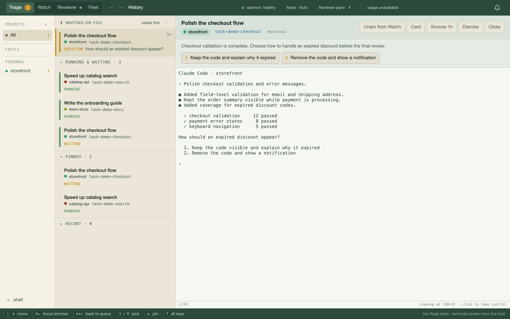
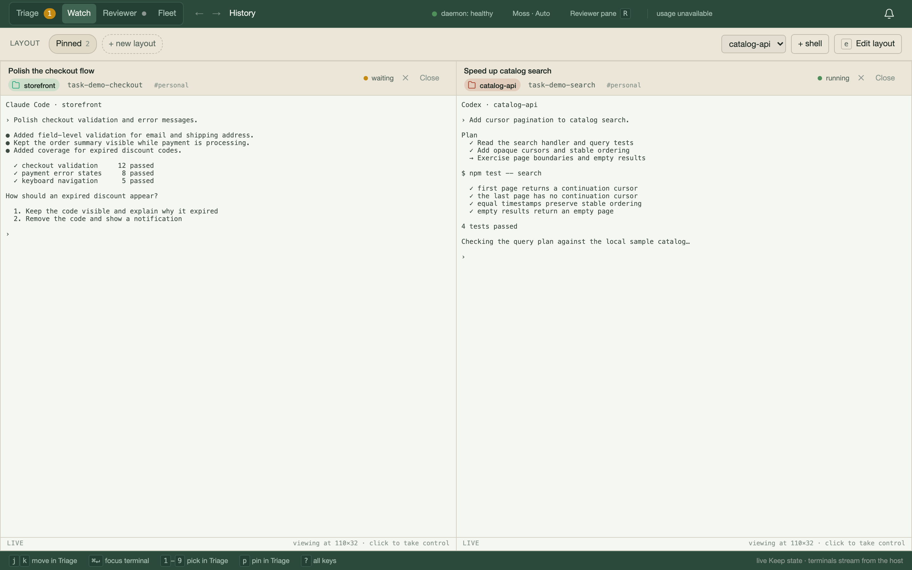

# Keep

Keep helps you manage work across Claude Code and Codex sessions. It combines a
private task registry, a console for your agents' terminals, and a background service
that follows up on work after you leave a conversation.

Use it when you have several projects or agents running at once: see who needs an
answer, remember what each session is doing, resume unfinished work, and arrange
for an agent to check something later. A task survives the terminal session that
started it, with its plan, decisions, dependencies, and next step intact.

Each person runs their own Keep. Your tasks live in a private, Git-backed registry;
this repository contains the application source. “Fleet” means the collection of
agent sessions your Keep tracks across your projects.

## What you can do with it

- **Keep a durable record of work.** Each task is a Markdown card with a status,
  project, tags, plan, and check-in history. Agents can record commits, experiment
  identifiers, results, and the next action, so a later session can pick up where
  they left off.
- **See where your input is needed.** Triage brings together agent questions,
  permission requests, completed turns, and other attention items. Open the related
  terminal, answer a question, or snooze an item while working on something else.
- **Follow several sessions at once.** Pin terminals in Watch, switch between
  projects, and launch or resume Claude Code and Codex sessions from the console or
  CLI. The terminal host owns the processes, so closing the console window or
  restarting the daemon leaves those sessions running.
- **Make follow-up work executable.** Give a task a time and a check recipe, such as
  “check the experiment tomorrow and report whether it has enough samples.” Keep
  attempts to deliver the recipe to the associated session when it is available,
  or runs it in a headless agent when needed.
- **Coordinate dependent work.** Record that one task depends on another task or a
  particular plan step. When that dependency is satisfied, Keep notifies the
  waiting session so it can continue. Questions for you can also be recorded in a
  persistent inbox instead of getting lost at the end of a conversation.
- **Get a second opinion across projects.** A dedicated reviewer examines changes
  in task records and session evidence, records findings, and highlights problems
  such as stalled work, conflicting claims, or missing verification. A separate
  daily ideas pass proposes improvements to recurring workflows.

To correct a card's repository, use `keep project <card> <path|name> -m "reason"`.
Run `keep project <card>` to see the current value. Reassignment preserves the
card's session links, status, scheduled checks, tags, and dependencies; a linked
worktree path resolves to its main checkout.

## A typical workflow

After setup, create a task and hand it to an agent. For example, from a project
checkout:

```sh
keep add "Improve checkout errors" --project "$PWD" --status active
keep open improve-checkout-errors --fresh -m "Inspect checkout validation, improve the error messages, and verify the changes."
```

The bundled Keep skill teaches the agent to record progress and next steps on the
card. You can watch its terminal in the console and respond when it needs a
decision. From another terminal, inspect the task or get an overview:

```sh
keep show improve-checkout-errors
keep list
keep brief
keep resume
```

For longer-running work, the important part is recording what should happen next.
A deployment check can have a scheduled recipe; a frontend task can wait on an API
task; an experiment can retain its identifier and the criteria for evaluating it.
These records give the next agent concrete instructions rather than requiring you
to reconstruct the previous conversation.

## Automation included

The daemon runs scheduling and bookkeeping in the background. Depending on your
configuration and available agent sessions, Keep can:

- Run due check recipes and deliver dependency notifications.
- Run reviewer ticks and the daily ideas sweep, generate a standup draft, and flag
  stale or inconsistent task records.
- Detect when cited commits reach a project's default branch and update eligible
  task records according to the configured landing policy.
- Track model usage, defer work when budget headroom is low, and resume eligible
  sessions after usage limits reset.
- Compact supported sessions when enabled, reconcile parent and child session
  activity, and check process ownership and outstanding jobs before automated
  session cleanup or restart.

Scheduling, model access, and launch permissions are separate controls. Model-backed
checks and reviews use your Claude account; Keep is not a model service. Optional
Slack polling and notification integrations require their own configuration.
See [configuration](#configuration) and the [command reference](docs/reference.md)
for the controls and prerequisites.

## How the pieces fit together

| Piece | What it does |
| --- | --- |
| Private registry | Stores task cards, plans, and check-ins in Git, with runtime state kept separately inside the registry directory. |
| CLI and agent hooks | Let you and your agents update cards and connect work to session activity. |
| Daemon | Serves the console/API and runs the background schedulers. |
| Terminal host | Owns agent processes and streams their terminals to the console. |
| Browser and desktop app | Provide Triage, pinned terminals, fleet status, and reviewer views. The macOS shell adds native notifications and a Dock badge. |
| Mobile app | Connects to your daemon to check work, respond to sessions, and read reviewer activity from your phone. |

The initial host setup targets macOS. The desktop shell and Expo mobile app are
included in this repo; each connects to your own running Keep service. The registry
stays local unless you explicitly configure synchronization with a private remote.

## Screenshots

The console shared by Keep Desktop and the browser, shown with synthetic demo
projects and terminal output. No private cards or sessions are pictured.

**Triage:** see which sessions need your input and respond beside their terminal.



**Watch:** pin sessions side by side to follow work across projects.



## Install

Prerequisites: Node 22+, Git with a configured name/email, and an authenticated
Claude Code installation for reviewer and headless automation. Codex is optional.

```sh
git clone https://github.com/jesseruder/keep-tool.git
cd keep-tool
npm ci
npm link
keep init
keep setup hooks
keep doctor
keep service install
keep service start
```

Open `http://localhost:7777/app`. Launch `keep-reviewer` in an interactive terminal
to create a host-owned reviewer pane for review ticks. The terminal attaches to that
pane; the reviewer also appears in the console. Both agent skills are bundled; the reviewer
registers through its Claude SessionStart hook. Existing hook settings and skills
are preserved: setup backs up settings and refuses to replace another skill.
See [agent integration](docs/agent-hooks.md) for Codex event adapters.

`keep init` creates an empty registry at `~/keep`; use `--dir /path/to/private-data`
to choose another location. It refuses nonempty directories. It does not configure
a remote, upload anything, launch an agent, or start background services.

## Desktop app (macOS)

Keep Desktop adds a native window, Dock badge, and desktop notifications to the
console. Complete the CLI setup above first: the app connects to
`http://localhost:7777/app` and requires the Keep daemon to be running.

To build it, install Rust with Cargo and the Xcode Command Line Tools (or Xcode),
as described in the [Tauri macOS prerequisites](https://v2.tauri.app/start/prerequisites/#macos).
Then run these commands from the `keep-tool` checkout:

```sh
npm ci --prefix desktop
npm run desktop:build
open desktop/src-tauri/target/release/bundle/macos/Keep.app
```

To install the built app for everyday use, copy `Keep.app` from that folder into
Applications using Finder. The build also produces a DMG under
`desktop/src-tauri/target/release/bundle/dmg/`.

For development, use `npm run desktop:dev` instead of the build command. Closing
the window hides the app; Quit exits it. Enable notifications from the bell inbox
when prompted. If the launcher stays on its waiting screen, check
`keep service status` and confirm the daemon is listening on port 7777.

The app uses the local console, so most CLI and web changes need no native rebuild.
Rebuild it when the desktop shell changes. See [desktop details](desktop/README.md).

## Mobile app

The Expo app supports your own server and access token. See [mobile setup and build
instructions](app/README.md).

## Configuration

`~/.config/keep/config.json` selects your private registry and environment defaults:

```json
{
  "version": 1,
  "dataDir": "~/keep",
  "env": {
    "KEEP_NO_PUSH": "1",
    "KEEP_SYNC": "0",
    "KEEP_HOST": "127.0.0.1",
    "KEEP_REVIEWER_MODEL": "fable",
    "KEEP_IDEAS_MODEL": "fable",
    "KEEP_OPEN_CLAUDE_FLAGS": "",
    "KEEP_OPEN_CODEX_FLAGS": "",
    "KEEP_AUTO_CLOSE_DONE_MIN": "15"
  }
}
```

Environment variables override configuration. `KEEP_CONFIG` selects another file.
An explicit `KEEP_DIR` without `KEEP_CONFIG` selects an isolated registry without
loading the default configuration. Model settings name models available to your
Claude installation; `keep doctor` checks executables, not model entitlements.

Starting the daemon enables the automation schedulers. Model-backed work uses your
agent account. Scheduled recipes run in agents, and the reviewer is an ordinary
interactive agent with the permissions you give it. Set launch permission flags
explicitly if your workflow needs unattended privileged actions. Compaction keeps
its existing `KEEP_AUTO_COMPACT` control; see the [command reference](docs/reference.md).
Done-card sessions close after 15 idle minutes by default; set
`KEEP_AUTO_CLOSE_DONE_MIN` to another number of minutes, or set `KEEP_AUTO_CLOSE=0`
to disable automatic session and shell cleanup.

Remote access requires setting `KEEP_HOST` explicitly; the default binds only to
loopback. Remote API requests use the private registry's `.keep/token`.
Keep that token and the registry private.

Git commits stay local by default after initialization. To sync a registry, add a
**private** Git remote, set the branch's upstream, set `KEEP_SYNC=1`, and remove
`KEEP_NO_PUSH` to restore background pushes outside agent sessions. Agent pushes
still require session authorization (`KEEP_ALLOW_PUSH=1`). The code repository
and registry must have separate remotes. Never point a registry at keep-tool.

Slack polling activates only when `watch/slack.json` in your private registry names
channels. Its adapter currently requires a compatible MCP CLI configured through
`KEEP_JESSE_MCP` (legacy variable name); it is not a standalone Slack integration.
Phone pushes use `KEEP_PUSH_WEBHOOK`; speaker notifications require an `announce`
command. Credentials belong in the local environment/configuration, never source.

Scope tags default to `work` and `personal`, with projects under `~/work` assigned
`work`. Customize the names and ordered path rules in your local configuration:

```json
{
  "version": 1,
  "dataDir": "~/keep",
  "scopes": {
    "names": ["work", "personal"],
    "default": "personal",
    "rules": [{ "path": "~/work", "scope": "work" }]
  },
  "modelBudgets": {
    "fable": { "inputPrice": 15, "minHeadroom": 10 }
  }
}
```

Merge these fields into your existing config, preserving its `env` settings.
The CLI, lint checks, and console share scope rules; the first matching rule wins.
The standup uses the first configured scope (`KEEP_STANDUP_SCOPE` overrides it).
Paths match directory boundaries, and a rule can set `excludeSegmentPrefix` to
skip projects with a matching path segment. Existing tags are never renamed.
To retain a `castle`/`personal` setup, use those names and a `~/castle` rule;
`excludeSegmentPrefix: "jesse-"` preserves the original personal-project exception.

Fable remains the reviewer and ideas default. `modelBudgets` overrides each
family's input-price weight (per million tokens), minimum remaining usage percentage,
and optional exact `weeklyLabel`. Existing family weights and shared weekly/5-hour
checks remain in effect; a missing configured bucket stops review until usage is
available. Environment overrides `KEEP_SCOPES` and `KEEP_MODEL_BUDGETS` accept the
corresponding JSON objects. Restart the daemon after changing configuration.

## Develop and update

Develop in this code checkout. `npm link` points the CLI at it, so edits take effect
on the next command. `keep service restart` restarts only the daemon, preserving
host-owned terminals. Host changes use `keep host reload`; stop/start affects all
hosted sessions. Rebuild the desktop shell only when its native code changes.

```sh
git pull --ff-only
npm ci
npm test
keep service restart
```

For an existing registry, select it with `KEEP_DIR` or write the configuration above
instead of running `keep init`. Keep its Git history intact. Existing services and
skills require a deliberate migration; setup will not overwrite them.

## Public source checks

Run `npm run check:public` before committing or publishing. It checks the staged
file paths and scans tracked source for credential-shaped strings. `npm pack` also
runs that check. Run an independent secret scanner before the first public push:

```sh
gitleaks dir . --redact --no-banner
gitleaks git . --redact --no-banner
```

The source extraction has fresh history. Cards, archives, digests, reviews, watch
configuration, gated-step registries, runtime state, private reports, and machine
service files are excluded. Tests use synthetic fixtures. Updates should be made
here rather than by copying whole private checkouts back into this repository.

See the [full command reference](docs/reference.md), [Keep skill](skills/keep/SKILL.md),
[fleet reviewer procedure](skills/fleet-review/SKILL.md), and [desktop README](desktop/README.md).

## Session handoffs

Handoffs are turn-scoped and require a scheduled check time and recipe. For example:

```sh
keep checkin <card> --check-after +1h --check "Check progress and report the result" --handoff waiting -m "Waiting for the scheduled check"
```

Use `--handoff needs-input` instead when you also need the owner's decision.
A later turn invalidates the handoff. Without a scheduled recipe, record the
appropriate card status and next step; see the [Keep skill](skills/keep/SKILL.md)
and [session reliability](docs/session-reliability.md).
